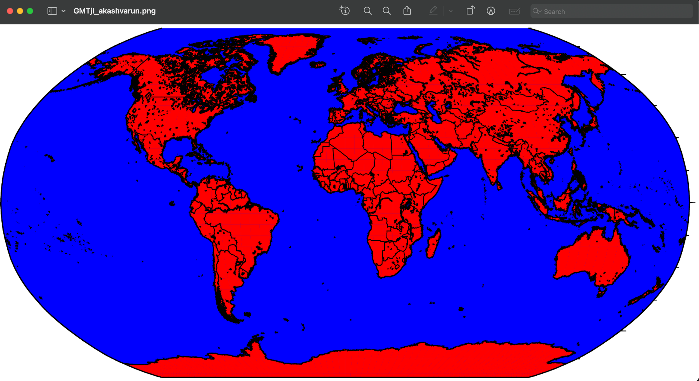

# OpenAI-with-Julia-
OpenAI with Julia 

#### Map Generator with OpenAI and GMT

This Julia script utilizes the OpenAI API and the Generic Mapping Tools (GMT) library to generate a map of countries based on user input. The map is created using the GPT-3.5 Turbo model for natural language processing.
